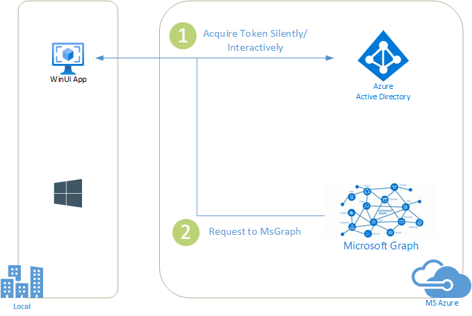

# WinUi desktop application with MSAL

[](https://identitydivision.visualstudio.com/IDDP/_build/latest?definitionId=XXX)

* [Overview](#overview)
* [Scenario](#scenario)
* [Prerequisites](#prerequisites)
* [Setup the sample](#setup-the-sample)
* [Explore the sample](#explore-the-sample)
* [Troubleshooting](#troubleshooting)
* [About the code](#about-the-code)
* [How the code was created](#how-the-code-was-created)
* [Next Steps](#next-steps)
* [Contributing](#contributing)
* [Learn more](#learn-more)

## Overview

This sample demonstrates a ASP.NET Core Web App calling a ASP.NET Core Web API that is secured using Azure AD.

## Scenario

This sample demonstrates a ASP.NET Core Web App calling a ASP.NET Core Web API that is secured using Azure AD.

1. The client ASP.NET Core Web App uses the [Microsoft.Identity.Web](https://aka.ms/microsoft-identity-web) to sign-in a user and obtain a JWT [Access Token](https://aka.ms/access-tokens) from **Azure AD**.
1. The access token is used as a *bearer* token to authorize the user to call the ASP.NET Core Web API protected by **Azure AD**.
1. The service uses the [Microsoft.Identity.Web](https://aka.ms/microsoft-identity-web) to protect the Web api, check permissions and validate tokens.



## Prerequisites

* Either [Visual Studio](https://visualstudio.microsoft.com/downloads/) or [Visual Studio Code](https://code.visualstudio.com/download) and [.NET Core SDK](https://www.microsoft.com/net/learn/get-started)
* An **Azure AD** tenant. For more information, see: [How to get an Azure AD tenant](https://docs.microsoft.com/azure/active-directory/develop/test-setup-environment#get-a-test-tenant)
* A user account in your **Azure AD** tenant. This sample will not work with a **personal Microsoft account**. If you're signed in to the [Azure portal](https://portal.azure.com) with a personal Microsoft account and have not created a user account in your directory before, you will need to create one before proceeding.
* [Windows App SDK C# VS2022 Templates](https://learn.microsoft.com/windows/apps/windows-app-sdk/downloads)


## Setup the sample

### Step 1: Clone or download this repository

From your shell or command line:

```console
git clone https://github.com/Azure-Samples/ms-identity-netcore-winui.git
```

or download and extract the repository *.zip* file.

> :warning: To avoid path length limitations on Windows, we recommend cloning into a directory near the root of your drive.

### Step 2: Navigate to project folder

```console
cd WinUIMSALApp
```

### Step 3: Register the sample application(s) in your tenant

There is one project in this sample. To register it, you can:

- follow the steps below for manually register your apps
- or use PowerShell scripts that:
  - **automatically** creates the Azure AD applications and related objects (passwords, permissions, dependencies) for you.
  - modify the projects' configuration files.

  <details>
   <summary>Expand this section if you want to use this automation:</summary>

    > :warning: If you have never used **Microsoft Graph PowerShell** before, we recommend you go through the [App Creation Scripts Guide](./AppCreationScripts/AppCreationScripts.md) once to ensure that your environment is prepared correctly for this step.
  
    1. On Windows, run PowerShell as **Administrator** and navigate to the root of the cloned directory
    1. In PowerShell run:

       ```PowerShell
       Set-ExecutionPolicy -ExecutionPolicy RemoteSigned -Scope Process -Force
       ```

    1. Run the script to create your Azure AD application and configure the code of the sample application accordingly.
    1. For interactive process -in PowerShell, run:

       ```PowerShell
       cd .\AppCreationScripts\
       .\Configure.ps1 -TenantId "[Optional] - your tenant id" -AzureEnvironmentName "[Optional] - Azure environment, defaults to 'Global'"
       ```

    > Other ways of running the scripts are described in [App Creation Scripts guide](./AppCreationScripts/AppCreationScripts.md). The scripts also provide a guide to automated application registration, configuration and removal which can help in your CI/CD scenarios.

  </details>

#### Choose the Azure AD tenant where you want to create your applications

To manually register the apps, as a first step you'll need to:

1. Sign in to the [Azure portal](https://portal.azure.com).
1. If your account is present in more than one Azure AD tenant, select your profile at the top right corner in the menu on top of the page, and then **switch directory** to change your portal session to the desired Azure AD tenant.

#### Register the client app (WinUI-App-Calling-MsGraph)

1. Navigate to the [Azure portal](https://portal.azure.com) and select the **Azure Active Directory** service.
1. Select the **App Registrations** blade on the left, then select **New registration**.
1. In the **Register an application page** that appears, enter your application's registration information:
    1. In the **Name** section, enter a meaningful application name that will be displayed to users of the app, for example `WinUI-App-Calling-MsGraph`.
    1. Under **Supported account types**, select **Accounts in this organizational directory only**
    1. Select **Register** to create the application.
1. In the **Overview** blade, find and note the **Application (client) ID**. You use this value in your app's configuration file(s) later in your code.
1. In the app's registration screen, select the **Authentication** blade to the left.
1. If you don't have a platform added, select **Add a platform** and select the **Public client (mobile & desktop)** option.
    1. In the **Redirect URIs** | **Suggested Redirect URIs for public clients (mobile, desktop)** section, select **ms-appx-web://microsoft.aad.brokerplugin/{ClientId}**
    1. Click **Save** to save your changes.
1. In the app's registration screen, select the **Certificates & secrets** blade in the left to open the page where you can generate secrets and upload certificates.
1. In the **Client secrets** section, select **New client secret**:
    1. Type a key description (for instance `app secret`).
    1. Select one of the available key durations (**6 months**, **12 months** or **Custom**) as per your security posture.
    1. The generated key value will be displayed when you select the **Add** button. Copy and save the generated value for use in later steps.
    1. You'll need this key later in your code's configuration files. This key value will not be displayed again, and is not retrievable by any other means, so make sure to note it from the Azure portal before navigating to any other screen or blade.
    > :bulb: For enhanced security, instead of using client secrets, consider [using certificates](./README-use-certificate.md) and [Azure KeyVault](https://azure.microsoft.com/services/key-vault/#product-overview).
    
##### Configure Optional Claims

1. Still on the same app registration, select the **Token configuration** blade to the left.
1. Select **Add optional claim**:
    1. Select **optional claim type**, then choose **ID**.
    1. Select the optional claim **acct**. 
    > Provides user's account status in tenant. If the user is a **member** of the tenant, the value is 0. If they're a **guest**, the value is 1.
    1. Select **Add** to save your changes.

##### Configure the client app (WinUI-App-Calling-MsGraph) to use your app registration

Open the project in your IDE (like Visual Studio or Visual Studio Code) to configure the code.

> In the steps below, "ClientID" is the same as "Application ID" or "AppId".

1. Open the `WinUIMSALApp\appsettings.json` file.
1. Find the key `TenantId` and replace the existing value with your Azure AD tenant/directory ID.
1. Find the key `ClientId` and replace the existing value with the application ID (clientId) of `WinUI-App-Calling-MsGraph` app copied from the Azure portal.
### Variation: web app using client certificates

Follow [README-use-certificate.md](README-use-certificate.md) to know how to use this option.

### Step 4: Running the sample

From your shell or command line, execute the following commands:

```console
    cd WinUIMSALApp
    dotnet run
```

## Explore the sample

<details>

 <summary>Expand the section</summary>

  Start running the sample by pressing `WinUIMSALApp (Package)` button on Visual Studio menu bar.

  No information is displayed because you're not logged in.
  Click `Sign-In and Call Microsoft Graph API` button.

  The UI similar to Web Browser will be displayed and give you a chance to select a user and login. You might be asked to consent to access your data on Graph API.

  Immediately after the UI will display basic user information as it is inside Graph API and some Token Info

  Click `Sign-Out` button -> all the information is deleted and `User has signed-out` message is shown.

  Look at Token Cache folder configured inside `appsettings.json` and find a file with binary information.

  If you sign-out and exit the application, then you will have to sign-in again when starting the UI.

  In case you were signed-in and just closed the UI, next time you will start the UI, you will be already signed-in - this is because token cache file is present and it will let you in until token expiration time is passed...
  The token expiration date/time is shown in `Token Info` in the UI.

  **So make sure to sign-out every time before closing the UI.**

  [LINK FOR SURVEY HERE]

</details>


## Troubleshooting

<details>
	<summary>Expand for troubleshooting info</summary>

ASP.NET core applications create session cookies that represent the identity of the caller. Some Safari users using iOS 12 had issues which are described in ASP.NET Core #4467 and the Web kit bugs database Bug 188165 - iOS 12 Safari breaks ASP.NET Core 2.1 OIDC authentication.

If your web site needs to be accessed from users using iOS 12, you probably want to disable the SameSite protection, but also ensure that state changes are protected with CSRF anti-forgery mechanism. See the how to fix section of Microsoft Security Advisory: iOS12 breaks social, WSFed and OIDC logins #4647
</details>

## About the code

<details>
 <summary>Expand the section</summary>
For general information about how the project is organized, refer to the [tutorial](https://learn.microsoft.com/windows/apps/winui/winui3/create-your-first-winui3-app)

The constuctor of `MainWindow` class was modified by adding a configuration, MSAL Authentication and token caching capability:

```csharp
   
    var configuration = new ConfigurationBuilder().AddJsonFile("appsettings.json").Build();
    _winUiSettings = configuration.GetSection("AzureAAD").Get<WinUISettings>();

    
    _PublicClientApp = PublicClientApplicationBuilder.Create(_winUiSettings.ClientId)
        .WithAuthority(string.Format(_winUiSettings.Authority, _winUiSettings.TenantId))
        .WithRedirectUri(string.Format(_winUiSettings.RedirectURL, _winUiSettings.ClientId))
 
        .WithLogging(new IdentityLogger(EventLogLevel.Warning), enablePiiLogging: false) 
        .Build();

    var storageProperties = new StorageCreationPropertiesBuilder(_winUiSettings.CacheFileName, _winUiSettings.CacheDir).Build();
    Task.Run(async () => await MsalCacheHelper.CreateAsync(storageProperties)).Result.RegisterCache(_PublicClientApp.UserTokenCache);
```

Every time a sign-in button is clicked and `CallGraphButton_Click` callback function is called, new `MsGraph` client is created by obtaining access token silently or interactively. Then a call to Graph API is done.

The access token is obtained inside `SignInUserAndGetTokenUsingMSAL` method, if there is no token cache available, then exception thrown and interactive session takes place, where a user should provide credentials and may also be asked to consent.

```csharp
    private async Task<string> SignInUserAndGetTokenUsingMSAL(string[] scopes)
        {
            _currentUserAccount = _currentUserAccount ?? (await _PublicClientApp.GetAccountsAsync()).FirstOrDefault();
            try
            {
                _authResult = await _PublicClientApp.AcquireTokenSilent(scopes, _currentUserAccount).ExecuteAsync();
                DispatcherQueue.TryEnqueue(() =>
                {
                    this.CallGraphButton.Content = _buttonTextAuthorized;
                });
            }
            catch (MsalUiRequiredException ex)
            {
                Debug.WriteLine($"MsalUiRequiredException: {ex.Message}");

                _authResult = await _PublicClientApp.AcquireTokenInteractive(scopes)
                                                  .ExecuteAsync();
            }
            return _authResult.AccessToken;
        }
```

To understand more how the buttons are linked to the callback functions, open `MainWindow.xaml` file and learn the below lines, notice Click properties:

```xml
    <Button x:Name="CallGraphButton" Content="Sign-In and Call Microsoft Graph API" HorizontalAlignment="Right" Padding="5" Click="CallGraphButton_Click" Margin="5" FontFamily="Segoe Ui"/>
    <Button x:Name="SignOutButton" Content="Sign-Out" HorizontalAlignment="Right" Padding="5" Click="SignOutButton_Click" Margin="5" Visibility="Collapsed" FontFamily="Segoe Ui"/>

```

</details>

## How the code was created

 The current sample is based on [UWP sample](https://github.com/Azure-Samples/active-directory-dotnet-native-uwp-v2) in terms of UI and logical structure - it is similar for both.

 To build an initial project, you can use [WinUI 3 Templates for Visual Studio](https://learn.microsoft.com/windows/apps/winui/winui3/winui-project-templates-in-visual-studio)

 It might be helpful to read [Initial project creation instructions](https://learn.microsoft.com/windows/apps/winui/winui3/create-your-first-winui3-app) as well.

 

## Next Steps

Learn how to:

* [Change your app to sign-in users from any organization or Microsoft accounts](https://github.com/Azure-Samples/active-directory-aspnetcore-webapp-openidconnect-v2/tree/master/1-WebApp-OIDC/1-3-AnyOrgOrPersonal)
* [Enable users from National clouds to sign-in to your application](https://github.com/Azure-Samples/active-directory-aspnetcore-webapp-openidconnect-v2/tree/master/1-WebApp-OIDC/1-4-Sovereign)
* [Enable your web app to call a web API on behalf of the signed-in user](https://github.com/Azure-Samples/ms-identity-dotnetcore-ca-auth-context-app)

## Contributing

If you'd like to contribute to this sample, see [CONTRIBUTING.MD](/CONTRIBUTING.md).

This project has adopted the [Microsoft Open Source Code of Conduct](https://opensource.microsoft.com/codeofconduct/). For more information, see the [Code of Conduct FAQ](https://opensource.microsoft.com/codeofconduct/faq/) or contact [opencode@microsoft.com](mailto:opencode@microsoft.com) with any additional questions or comments.

## Learn more

 [WinUi open source project](https://github.com/microsoft/microsoft-ui-xaml)

 [ILogging interface](https://github.com/AzureAD/microsoft-authentication-library-for-dotnet/wiki/logging)

 


